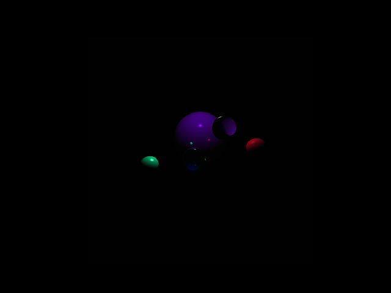

# Backwards Ray-Tracing Render

Program in C to create a render using backwards ray-tracing. In the present coded example, there are 5 spheres, with a light source above them: a big blue metallic sphere on the back, 2 smaller spheres in green and red, and 2 glass spheres. Different spheres can be added similarly in the code, with the initialized properties as seen in the main section of the code. The main C routine will create a file called shaded.txt, serving as an input for the python script do the plot.



## Installation

Inside the directory containing the files above, compile with make:

```bash
  $ make
```
    
## Usage

```bash
  $ ./raytracer <resolution>
```

