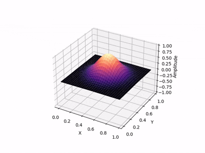
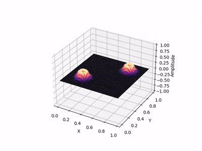
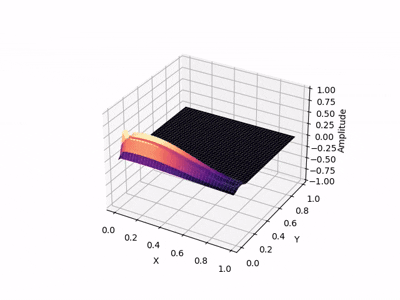

# 2D Wave Equation Demonstration

This python script shows the behavior of the 2D mechanical wave equation on a domain with specific boundary conditions (absorbing, reflecting) and inital conditions.

## Theoretical Background

The 2D wave equation for a field $u(x,y,t)$ is given by 

$$\dfrac{\partial u}{\partial t} = c^2 \Delta u$$,

where $c$ is the speed of sound and $\Delta$ the Laplacian. The FDTD scheme for this equation follows the standard Lepfrog scheme written as 

$$u_{i,j}^{n+1} = \dfrac{1}{2}(u_{i+1,j}^{n} + u_{i-1,j}^{n} + u_{i,j+1}^{n} + u_{i,j-1}^{n}) - u_{i,j}^{n-1}$$,

for given grid positions $i, j$ and time step $n$, considering a CFL number of $1 / \sqrt{2}$ in the threshold of the stability condition (see reference [2]).


## Installation

After having python and pip installed in a GNU/Linux machine, install the requirements with:

```bash
  $ pip install numpy matplotlib scipy
```
    
## Usage

Execute with:

```bash
  $ python3 waves.py
```

The program will prompt the user with the possible options. Then it will plot the pulse spectrum, an animation of the simulation and finally the impulse response on a receiver (see simulation parameters, can be changed).

As a first example, it can be seen a standing wave for a central Gaussian pulse as initial condition:



For absorbing boundaries, the next animation shows a good example:



What about a tsunami? It could also be roughly simulated with this equation:




## License

Please see the LICENSE file for rights and limitations.


## References

[1] N. Giordano and H. Nakanishi, "Computational Physics". Pearson, 2005.

[2] K. Kowalczyk, "Boundary and Medium Modelling Using Compact Finite Difference Schemes in Simulations of Room Acoustics for Audio and Architectural Design Applications". PhD Thesis, The Queen’s University of Belfast, 2008.
